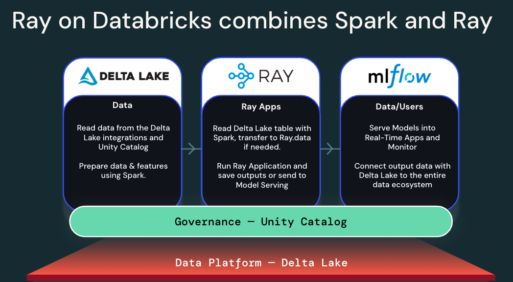

## Business Problem
Many organizations today face a critical challenge in their data science and analytics operations. Data scientists, statisticians, and data developers are often relying on legacy single-node processes to perform complex scientific computing tasks such as optimization, simulation, linear programming, and numerical computing. While these approaches may have been sufficient in the past, they are increasingly inadequate in the face of two major trends:

1. The exponential growth in data volume and complexity that needs to be modeled and analyzed.
2. Heightened business pressure to obtain modeling results and insights faster to enable timely decision-making.

As a result, there is an urgent need for more advanced, scalable techniques that can handle larger datasets and deliver results more quickly. However, transitioning away from established single-node processes presents several challenges:
* Existing code and workflows are often tightly coupled to single-node architectures.
* Data scientists may lack expertise in distributed computing paradigms.
* There are concerns about maintaining reproducibility and consistency when scaling to distributed environments.
* The cost and complexity of setting up and managing distributed infrastructure can be prohibitive.

To address these challenges, this repository demonstrates an expanding set of approaches leveraging the distributed computing framework Ray, implemented on the Databricks data lakehouse platform. The solutions presented aim to:
* Scale single-node processes horizontally with minimal code refactoring, preserving existing workflows where possible.
* Achieve significant improvements in runtime and performance, often by orders of magnitude.
* Enable organizations to make better, more timely business decisions based on the most up-to-date simulation or optimization results.
* Provide a smooth transition path for data scientists to adopt distributed computing practices.
* Leverage the managed infrastructure and integrated tools of the Databricks platform to simplify deployment and management.

By adopting these approaches, organizations can modernize their scientific computing capabilities on Databricks to meet the demands of today's data-intensive business environment. This allows them to unlock new insights, respond more quickly to changing conditions, and gain a competitive edge through advanced analytics at scale.

This repo currently contains examples for the following scientific computing use-cases:

### 1. Batch AI Inference

This solution demonstrates how to leverage Ray's distributed computing capabilities for efficient batch inference across different AI modalities, including text-to-image processing, automatic speech recognition with Whisper-v3, and video processing with Qwen2.5 VL.

Get started here: [Batch AI Inference](Batch_AI_Inference/README.md)

### 2. Bin Packing Optimization

The bin packing problem is a classic optimization challenge with significant real-world implications, and this solution demonstrates how to scale a Python library to solve it efficiently using Ray Core components.

Get started here: [Bin Packing Optimization](Bin_Packing_Optimization/README.md)

### 3. DevOps Deployment with DABs

This solution showcases how to streamline the deployment and management of Ray applications in production environments using Databricks Asset Bundles (DABs), enabling consistent packaging, dependency management, and CI/CD pipeline implementation.

Get started here: [DevOps Deployment with DABs](DevOps_Deployment_DABs/README.md)

### 4. Hyperparameter Optimization

This solution demonstrates how to perform distributed hyperparameter optimization using Ray Tune and Optuna, covering various use cases from general machine learning models to specialized XGBoost and deep learning implementations.

Get started here: [Hyperparameter Optimization](Hyperparam_Optimization/README.md)

### 5. Many Models Training

This solution shows how to implement parallel training of thousands of models using Ray, with a specific focus on demand forecasting using the Walmart M5 dataset. It demonstrates significant reduction in training time through efficient parallelization.

Get started here: [Many Models Training](Many_Models_Training/README.md)

### 6. Ray Dashboard Metrics

This solution provides comprehensive guidance on setting up and utilizing the Ray Dashboard on Databricks for monitoring cluster performance, resource utilization, and application metrics in real-time.

Get started here: [Ray Dashboard Metrics](Ray_Dashboard_Metrics/README.md)

## Reference Architecture

<!--  -->

## Authors
- <tj@databricks.com> 
- <amine.elhelou@databricks.com>
- <puneet.jain@databricks.com>
- <samantha.wise@databricks.com>

## Project support 

Please note the code in this project is provided for your exploration only, and are not formally supported by Databricks with Service Level Agreements (SLAs). They are provided AS-IS and we do not make any guarantees of any kind. Please do not submit a support ticket relating to any issues arising from the use of these projects. The source in this project is provided subject to the Databricks [License](./LICENSE.md). All included or referenced third party libraries are subject to the licenses set forth below.

Any issues discovered through the use of this project should be filed as GitHub Issues on the Repo. They will be reviewed as time permits, but there are no formal SLAs for support. 

## License

&copy; 2025 Databricks, Inc. All rights reserved. The source in this notebook is provided subject to the Databricks License [https://www.databricks.com/legal/db-license].  All included or referenced third party libraries are subject to the licenses set forth below.

| library                                | description             | license    | source                                              |
|----------------------------------------|-------------------------|------------|-----------------------------------------------------|
|ray|Framework for scaling AI/Python applications|[Apache 2.0](https://github.com/ray-project/ray/blob/master/LICENSE)|[ray-project/ray](https://github.com/ray-project/ray)|
|py3dbp|3D Bin Packing implementation|[MIT](https://github.com/enzoruiz/3dbinpacking/blob/master/LICENSE)|[enzoruiz/3dbinpacking](https://github.com/enzoruiz/3dbinpacking)|
|prometheus|Service monitoring system|[Apache 2.0](https://github.com/prometheus/prometheus/blob/main/LICENSE)|[prometheus/prometheus](https://github.com/prometheus/prometheus)|
|grafana|Open-source platform for monitoring and observability|[AGPL-3.0-only](https://github.com/grafana/grafana/blob/main/LICENSE)|[grafana/grafana](https://github.com/grafana/grafana/tree/main)|
